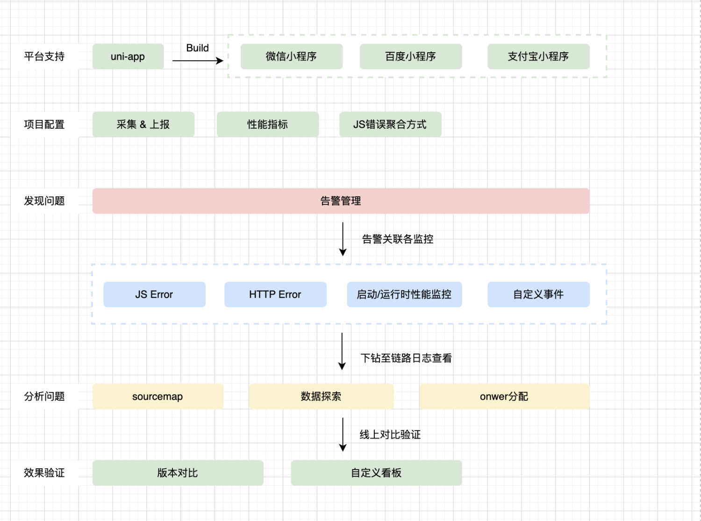

# 背景

随着业务愈来愈复杂，各厂商小程序管理后台免费提供的监控能力逐渐满足不了跨端的需求。当前有小程序监控需求的用户都面临以下痛点：

- 仅支持 1 ~ 2 个小程序平台，不支持主流小程序跨端开发框架，如 uni-app 和 Taro
- 异常监控、请求监控、启动/运行时性能监控能力薄弱
- sdk 配置繁琐、体积大、性能损耗高、接入成本高

# 目标

- 可跨平台：支持微信、百度等多个原生小程序接入，同时适配框架 Uni-app
- 监控能力完善：支持按需加载适配层以及集成模块，且包含丰富的生命周期，满足不同业务场景的自定义配置需求。
- 简单易用：体积小、性能损耗可控、低成本接入(仅需少量代码即可完成初始化)

# 现状分析

## 监控分析(稳定性+性能监控)

- todo

## 埋点分析(用户行为)

- todo

## 埋点分析(业务埋点) - 如何接入 infra

- todo

# 监控平台能力

[小程序错误监控分享](https://zhuanlan.zhihu.com/p/608703219)

## JS 错误聚合方式

（todo）根据报错信息先匹配出报错类型和报错描述，再根据两者信息求 hash 值得到 issueId

## Config 信息

| 类型           | 含义                                                      |
| :------------- | :-------------------------------------------------------- |
| 项目信息       | 项目 id                                                   |
| 应用信息       | 小程序版本号、基础库版本号、用户 id                       |
| 系统信息       | ios/安卓/pc，设备品牌、设备型号、设备系统版本、App 版本号 |
| 网络状态       | 网络状态 网络类型、信号强度                               |
| 内存信息       | 是否内存紧张                                              |
| sourcemap 信息 | 还原出编译后报错源码的位置，帮助开发快速定位问题          |

## JS Error

| 类型           | 对应 api                                     |
| :------------- | :------------------------------------------- |
| onError        | 用户点击打开小程序后首屏渲染完成的占比       |
| 常规 error     | App.onError()、xx.onError()、console.error() |
| Promise Error  | 仅微信 wx.onUnhandledRejection()             |
| 路由           | error xx.onPageNotFound()                    |
| 资源加载 error |                                              |

## 启动性能

- 启动的定义：小程序的启动过程以「用户打开小程序」为起点，到小程序「首页渲染完成」为止

| 阶段                          | 含义                       |
| :---------------------------- | :------------------------- |
| Loading                       | 下载小程序包阶段           |
| First Paint（FP）             | 界面的首次绘制             |
| First Contentful Paint（FCP） | 首次有内容的绘制           |
| First Meaningful Paint（FMP） | 首次有意义的绘制           |
| Time to Interactive（TTI）    | 页面绘制完成，达到可交互状 |

| 指标     | 含义                                                       |
| :------- | :--------------------------------------------------------- |
| 到达率   | 用户点击打开小程序后首屏渲染完成的占比                     |
| 白屏率   | 用户触发页面打开间隔一定时间后仍然没有任何页面绘制，为白屏 |
| 上屏时长 | 从用户点击小程序到首屏渲染完成的总加载耗时                 |

## 运行时性能

| 指标            | 含义                                                                                                                     |
| :-------------- | :----------------------------------------------------------------------------------------------------------------------- |
| JSError         | 小程序运行过程中 JS 文件运行发生错误的数量                                                                               |
| 请求耗时        | 用户触发页面打开间隔一定时间后仍然没有任何页面绘制，为白屏                                                               |
| HTTP 请求错误率 | 在网络可用的前提下，当使用小程序 request 网络请求，请求结果失败或服务端返回的错误码为 4XX/5XX ，则认为当次 HTTP 访问失败 |

# 监控指标

## 稳定性

- JS Error
- 内存告警
- 接口监控
- 资源加载异常
- 流量异常

## 性能监控

- 首屏加载
- 业务接口
- 白屏

## 用户行为

- 路由监控
- 事件监控
- 接口调用

## 业务埋点

- dau
- uv
- pv
- 停留时间
- 兼容性问题

# 数据采集

1. 初始化(平台、pid、mp-version、isDev、)
2. 注入 basic config(ua、)
